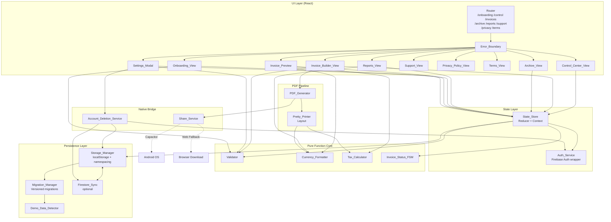
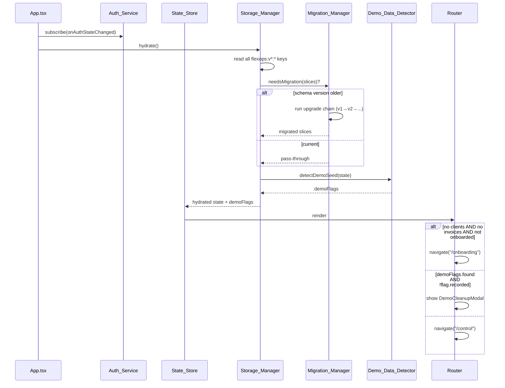
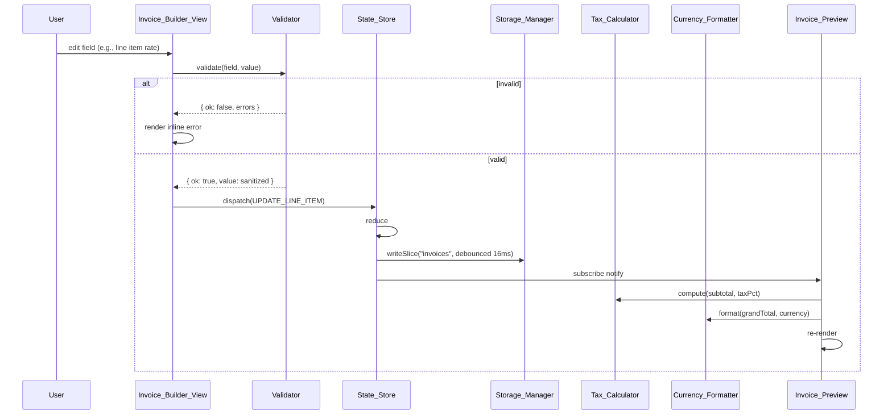
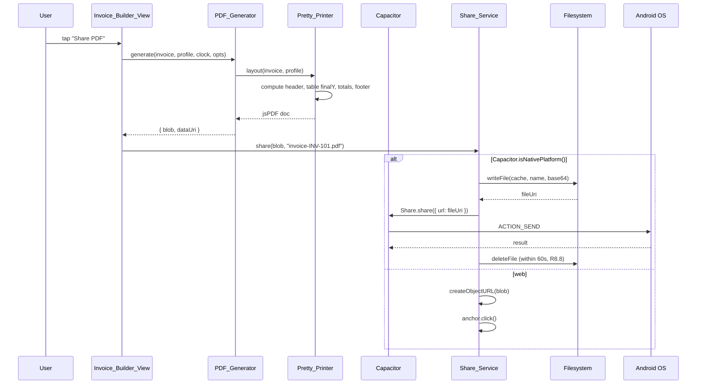
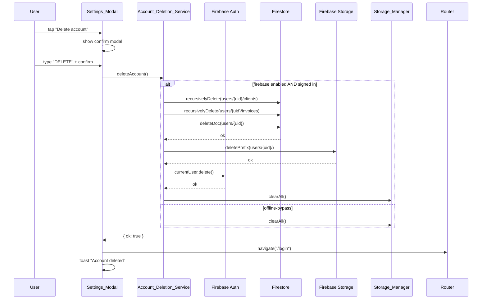
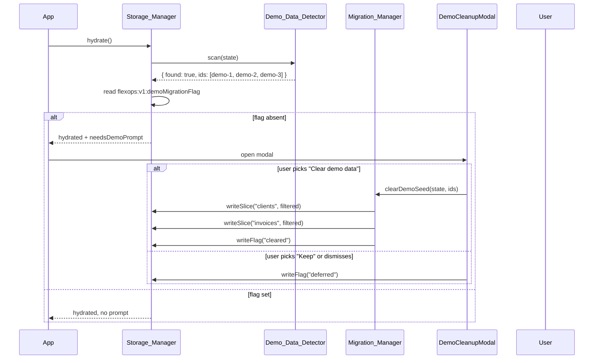

# Design Document

## Overview

This design refactors the existing single-screen "FlexOps / Apex Invoice Portal" into a Play Store launch-ready Android app while keeping the app buildable at every step.

The current implementation has three structural problems that this design corrects:

1. **`FirebaseContext.tsx` is doing five jobs at once** — auth listener, Firestore sync, localStorage persistence, in-memory state, and demo-seed bootstrap. We split this into `Storage_Manager` (persistence + namespacing + migrations), `State_Store` (reactive in-memory state via React context + reducer), and `Auth_Service` (Firebase auth wrapper).
2. **`pdfService.ts` depends on a CDN-loaded `window.html2pdf`** which is offline-broken, raster-rendered, and bans selectable text. We replace it with a local `PDF_Generator` built on `jspdf` + `jspdf-autotable`, with a dedicated `Pretty_Printer` that lays out pages deterministically using `finalY` math.
3. **The sidebar entries Archive / Reports / Support are dead links** — Google's Minimum Functionality policy will reject this. We introduce a real router and back each entry with a working view.

We also add the v1 must-haves required for Play Store: input validation, demo-seed migration, multi-currency, configurable tax, invoice status state machine, error boundaries, in-app legal pages, native share intent, and account deletion.

The design is a pragmatic refactor, not a rewrite. The existing components (`ClientCard`, `InvoicePreview`, `SettingsModal`, `Login`) are kept and rewired to consume new modules. The migration plan in §13 lays out an ordered sequence of refactor steps where the app remains buildable and shippable at every commit.

### Design Goals

- **Offline-first**: PDF generation, validation, formatting, and tax math all work with no network. Firebase is optional and degrades gracefully to localStorage.
- **Pure-function core**: `Validator`, `Currency_Formatter`, `Tax_Calculator`, `Pretty_Printer` (layout phase) are pure, deterministic, and property-testable.
- **Reactive persistence**: every State_Store mutation triggers a debounced write to Storage_Manager within 100 ms (R4.1).
- **Schema-versioned storage**: the `flexops:v{N}:` key prefix plus a `schemaVersion` field on every slice lets us run forward migrations without data loss (R4.5–R4.7).
- **Deterministic PDF output**: same input + same injected clock produces byte-equivalent output (R7.3–R7.4).
- **No demo seed data**: the existing `DEFAULT_CLIENTS` array (Aether Design Labs, Helios Launchpad, Stellar Flow) is removed; existing installs get a one-time migration prompt (R3).

### Non-Goals (v1)

Per requirements §"Out of Scope": recurring invoices, time tracking, mileage, expenses, receipt scanner, multi-business profiles, payment gateways. This design does not include hooks for these — they belong to a v1.x or v2 spec.

---

## Architecture

### Module Boundaries



### Layer Responsibilities

| Layer | Responsibility | Pure? | Touches I/O? |
|-------|---------------|-------|--------------|
| Pure Function Core | Validation, formatting, tax math, FSM transitions | Yes | No |
| State Layer | Reactive state, dispatch, auth session | No | No (delegates to persistence) |
| Persistence | Read/write/migrate localStorage and Firestore | No | Yes (storage) |
| PDF Pipeline | Layout + render Invoice → Blob/data URI | Layout pure, render impure | No (in-memory) |
| Native Bridge | Capacitor plugin invocations, account deletion | No | Yes (filesystem, network) |
| UI Layer | Render, dispatch, capture input | No | No (delegates) |

The arrows in the diagram are one-directional except for `SM <--> FS`. Pure modules never import non-pure modules. UI never imports persistence directly — it goes through `State_Store`.

### Data Flow Diagrams

#### Flow 1: App launch + hydrate



#### Flow 2: Invoice create/edit live preview



#### Flow 3: PDF generate + share



#### Flow 4: Account deletion



Note: the diagram orders Firestore first because once `Auth.delete()` succeeds, the `request.auth` token in security rules disappears and any subsequent Firestore/Storage delete fails with permission-denied. R12.4's stated order ("Auth → Firestore → Storage → local") is therefore implemented as **Firestore → Storage → Auth → local cache**. We treat the requirement as ordering by *what gets cleaned up*, not by the literal call order; the rationale is recorded as a decision in §13.

#### Flow 5: Demo data migration



---

## Components and Interfaces

This section defines TypeScript signatures for every module in the architecture. Files are organized to match the boundary diagram.

### Validator (`src/lib/validator.ts`)

Pure module. No imports from React, Firebase, or Capacitor.

```typescript
export type FieldCode =
  | 'REQUIRED'
  | 'TOO_LONG'
  | 'TOO_SHORT'
  | 'OUT_OF_RANGE'
  | 'BAD_FORMAT'
  | 'NOT_INTEGER'
  | 'TOO_MANY_DECIMALS'
  | 'UNSUPPORTED_CURRENCY'
  | 'BAD_MIME'
  | 'FILE_TOO_LARGE';

export interface FieldError {
  field: string;
  code: FieldCode;
  message: string; // ≤ 200 chars (R1.8)
}

export type Result<T> =
  | { ok: true; value: T }
  | { ok: false; errors: FieldError[] };

// Sanitization (R1.9): trim, collapse internal control chars except \n \t
export function sanitizeString(input: string): string;

// Per-field validators (R1.1–R1.11)
export function validateBrandName(input: string): Result<string>;       // 1–80 chars
export function validateProjectTitle(input: string): Result<string>;    // 1–80 chars
export function validateEmail(input: string): Result<string>;           // R1.6
export function validatePhone(input: string): Result<string>;           // R1.11
export function validateAddress(input: string): Result<string>;         // 1–500 chars (R1.7)
export function validateInvoiceNumber(input: string): Result<string>;   // R1.4
export function validateLineItemDescription(input: string): Result<string>; // 1–500 chars
export function validateAmount(input: number | string): Result<number>; // [0.01, 9_999_999.99], 2dp (R1.3)
export function validateQuantity(input: number | string): Result<number>; // integer [1, 9999] (R1.10)
export function validateTaxPercentage(input: number | string): Result<number>; // [0,100], 2dp (R1.10)
export function validateCurrencyCode(input: string): Result<CurrencyCode>; // R1.5
export function validateLogoFile(file: File): Result<File>;             // R13.1, R13.6

// Composite: validate an entire invoice draft, returning all errors at once (R1.12)
export function validateInvoiceDraft(draft: InvoiceDraft): Result<Invoice>;
export function validateClientDraft(draft: ClientDraft): Result<Client>;
export function validateProfileDraft(draft: ProfileDraft): Result<Profile>;
export function validateOnboardingDraft(draft: OnboardingDraft): Result<OnboardingPayload>;
```

### Currency_Formatter (`src/lib/currency.ts`)

Pure module. Uses `Intl.NumberFormat` for locale-correct grouping.

```typescript
export type CurrencyCode = 'USD' | 'INR' | 'EUR' | 'GBP';

export const SUPPORTED_CURRENCIES: ReadonlyArray<CurrencyCode>;

export interface CurrencyMeta {
  code: CurrencyCode;
  symbol: string;          // '$', '₹', '€', '£'
  position: 'prefix' | 'suffix';
  defaultLocale: string;   // 'en-US', 'en-IN', 'en-IE', 'en-GB'
}

export function getCurrencyMeta(code: CurrencyCode): CurrencyMeta;

// R14.2: standard symbol, locale grouping, exactly 2 decimals, half-up rounding
export function format(amount: number, code: CurrencyCode): string;

// R14 round-trip: parse(format(n, c)) === n to 2dp
export function parse(formatted: string, code: CurrencyCode): number | null;

// Half-up rounding helper (used by Tax_Calculator and format)
export function roundToCents(n: number): number;
```

### Tax_Calculator (`src/lib/tax.ts`)

Pure module.

```typescript
import { roundToCents } from './currency';

export interface InvoiceTotals {
  subtotal: number;   // sum(qty * rate)
  tax: number;        // round_to_cents(subtotal * taxPct / 100)
  grandTotal: number; // subtotal + tax
}

// R15.3: half-up rounding to cents
export function computeTax(subtotal: number, taxPct: number): number;

// Convenience for previews and PDF
export function computeTotals(lineItems: LineItem[], taxPct: number): InvoiceTotals;

// R15.4: e.g. "Tax (8%)", "Tax (7.5%)", "Tax (0%)" — no trailing zeros, ≤ 2dp
export function formatTaxLabel(taxPct: number): string;
```

### Invoice_Status_FSM (`src/lib/invoiceStatus.ts`)

Pure module. R16 transition table.

```typescript
export type InvoiceStatus = 'Draft' | 'Sent' | 'Paid' | 'Overdue' | 'Archived';

export const ALLOWED_TRANSITIONS: Readonly<Record<InvoiceStatus, ReadonlyArray<InvoiceStatus>>> = {
  Draft:    ['Sent'],
  Sent:     ['Paid', 'Overdue'],
  Overdue:  ['Paid'],
  Paid:     ['Archived'],
  Archived: [],
};

export function canTransition(from: InvoiceStatus, to: InvoiceStatus): boolean;

export function applyTransition(
  inv: Invoice,
  to: InvoiceStatus,
  clock: Clock
): Result<Invoice>;

// R16.5: on launch, mark Sent invoices with past dueDate as Overdue
export function autoMarkOverdue(invoices: Invoice[], clock: Clock): Invoice[];
```

### Storage_Manager (`src/services/storageManager.ts`)

Impure. Owns localStorage I/O. Does not know about React.

```typescript
export const SCHEMA_VERSION = 2; // bump on breaking change
export const KEY_PREFIX = `flexops:v${SCHEMA_VERSION}:`;

export type SliceName =
  | 'profile'
  | 'clients'
  | 'invoices'
  | 'settings'
  | 'demoMigrationFlag'
  | 'onboardingComplete';

export interface PersistedSlice<T> {
  schemaVersion: number;
  data: T;
}

export interface StorageManager {
  hydrate(): Promise<HydratedState>;
  writeSlice<K extends SliceName>(name: K, data: SliceData[K]): Promise<void>;
  readSlice<K extends SliceName>(name: K): Promise<SliceData[K] | null>;
  clearAll(): Promise<void>;
  // Reactive write registration: returns a debounced writer used by State_Store
  bindReactiveWriter<K extends SliceName>(
    name: K
  ): (data: SliceData[K]) => void;
}

export interface HydratedState {
  profile: Profile | null;
  clients: Client[];
  invoices: Invoice[];
  settings: AppSettings;
  demoMigrationFlag: DemoMigrationFlag | null;
  onboardingComplete: boolean;
  /** True if Demo_Data_Detector found legacy seed entities and no flag is recorded */
  needsDemoPrompt: boolean;
  /** Set to a non-null error if hydration encountered a recoverable problem */
  warnings: HydrationWarning[];
}

export interface HydrationWarning {
  slice: SliceName;
  reason: 'corrupted' | 'migration_failed' | 'quota_exceeded' | 'unavailable';
  message: string;
}

// Factory: returns the production implementation backed by window.localStorage
export function createStorageManager(opts?: { storage?: Storage }): StorageManager;
```

**Reactive write semantics (R4.1):**

```typescript
// Internal: each slice writer coalesces calls within a 16 ms window using
// requestIdleCallback fallback to setTimeout(0). Final settled write completes
// within 100 ms (R4.1 SLA).
function debouncedSliceWriter<K extends SliceName>(
  name: K,
  underlying: (data: SliceData[K]) => Promise<void>
): (data: SliceData[K]) => void;
```

### Migration_Manager (`src/services/migrationManager.ts`)

```typescript
export interface Migration<TBefore, TAfter> {
  fromVersion: number;
  toVersion: number;
  slices: SliceName[];
  run(input: TBefore): TAfter;
}

export interface MigrationManager {
  /** R4.6: applies registered migrations in order; halts on failure (R4.7) */
  runUpgrades(slices: Record<SliceName, PersistedSlice<unknown>>):
    { ok: true; result: Record<SliceName, PersistedSlice<unknown>> } |
    { ok: false; failedAt: number; preserved: Record<SliceName, PersistedSlice<unknown>>; reason: string };

  /** R3: clears Demo_Seed_Set entities; idempotent */
  clearDemoSeed(state: { clients: Client[]; invoices: Invoice[] }):
    { clients: Client[]; invoices: Invoice[] };
}

export function createMigrationManager(): MigrationManager;
```

### Demo_Data_Detector (`src/services/demoDataDetector.ts`)

```typescript
export const DEMO_BRAND_NAMES = [
  'Aether Design Labs',
  'Helios Launchpad',
  'Stellar Flow',
] as const;

export interface DemoScanResult {
  found: boolean;
  clientIds: string[];   // ids of clients matched by brand name
  invoiceIds: string[];  // ids of invoices belonging to matched clients
}

export function detectDemoSeed(state: {
  clients: Client[];
  invoices: Invoice[];
}): DemoScanResult;
```

### State_Store (`src/state/store.tsx`)

Reactive context. Replaces the bulk of `FirebaseContext.tsx`.

```typescript
export interface AppState {
  profile: Profile | null;
  clients: Client[];
  invoices: Invoice[];
  settings: AppSettings;
  onboardingComplete: boolean;
  user: User | null;          // Firebase user or null in offline-bypass
  isFirebaseEnabled: boolean;
  loading: boolean;
}

export type Action =
  | { type: 'HYDRATED'; payload: HydratedState }
  | { type: 'SET_PROFILE'; profile: Profile }
  | { type: 'ADD_CLIENT'; client: Client }
  | { type: 'UPDATE_CLIENT'; client: Client }
  | { type: 'DELETE_CLIENT'; id: string }
  | { type: 'ADD_INVOICE'; invoice: Invoice }
  | { type: 'UPDATE_INVOICE'; invoice: Invoice }
  | { type: 'DELETE_INVOICE'; id: string }
  | { type: 'TRANSITION_INVOICE'; id: string; to: InvoiceStatus; clock: Clock }
  | { type: 'AUTO_MARK_OVERDUE'; clock: Clock }
  | { type: 'SET_SETTINGS'; settings: AppSettings }
  | { type: 'COMPLETE_ONBOARDING'; payload: OnboardingPayload }
  | { type: 'SET_USER'; user: User | null }
  | { type: 'CLEAR_ALL' };

export function reducer(state: AppState, action: Action): AppState;

export interface StoreApi {
  state: AppState;
  dispatch: (a: Action) => void;
  // High-level commands that compose validate + dispatch + persist
  saveProfile: (draft: ProfileDraft) => Promise<Result<Profile>>;
  createClient: (draft: ClientDraft) => Promise<Result<Client>>;
  updateClient: (c: Client) => Promise<Result<Client>>;
  deleteClient: (id: string) => Promise<void>;
  createInvoice: (draft: InvoiceDraft) => Promise<Result<Invoice>>;
  updateInvoice: (inv: Invoice) => Promise<Result<Invoice>>;
  transitionInvoice: (id: string, to: InvoiceStatus) => Promise<Result<Invoice>>;
  completeOnboarding: (payload: OnboardingPayload) => Promise<Result<void>>;
}

export const StoreProvider: React.FC<{
  children: React.ReactNode;
  storage: StorageManager;
  auth: AuthService;
  firestoreSync?: FirestoreSync;
  clock: Clock;
}>;

export function useStore(): StoreApi;
export function useAppState(): AppState;
```

The `StoreProvider` wires reactive persistence: the reducer dispatches an action, the new state is produced, and a `useEffect` per slice calls the debounced `Storage_Manager` writer. Firestore sync (when enabled) is implemented as a parallel subscriber that mirrors the same writes.

### Auth_Service (`src/services/authService.ts`)

```typescript
export interface AuthService {
  isFirebaseEnabled: boolean;
  getCurrentUser(): User | null;
  subscribe(cb: (user: User | null) => void): () => void;
  login(email: string, password: string): Promise<Result<User>>;
  register(email: string, password: string): Promise<Result<User>>;
  logout(): Promise<void>;
  /** Used by Account_Deletion_Service; throws if not signed in */
  deleteCurrentUser(): Promise<void>;
}

export function createAuthService(): AuthService;
```

### Firestore_Sync (`src/services/firestoreSync.ts`)

Optional layer. When Firebase is configured, mirrors `State_Store` writes to Firestore and listens for remote changes. When disabled, this module is not loaded (it sits behind a dynamic `import()` to keep it out of the main bundle).

```typescript
export interface FirestoreSync {
  start(uid: string, dispatch: (a: Action) => void): () => void;
  pushProfile(uid: string, p: Profile): Promise<void>;
  pushClient(uid: string, c: Client): Promise<void>;
  pushInvoice(uid: string, inv: Invoice, pdfBlob?: Blob): Promise<void>;
  deleteClient(uid: string, id: string): Promise<void>;
  deleteInvoice(uid: string, id: string): Promise<void>;
  /** Used by Account_Deletion_Service */
  recursivelyDeleteUser(uid: string): Promise<void>;
}

export async function loadFirestoreSync(): Promise<FirestoreSync>; // dynamic import
```

### PDF_Generator (`src/pdf/pdfGenerator.ts`) and Pretty_Printer (`src/pdf/prettyPrinter.ts`)

Replaces `src/services/pdfService.ts` entirely. The CDN `window.html2pdf` reference is deleted along with `<script>` tag in `index.html`.

```typescript
// pdfGenerator.ts
import jsPDF from 'jspdf';
import 'jspdf-autotable';

export interface PdfRenderOptions {
  clock: Clock;             // R7.4: deterministic time injection
  /** Optional override of accent color (defaults to settings.accentColor) */
  accentColor?: string;
  /** US Letter, points (R5.7) — fixed for v1 */
  format?: 'letter';
}

export interface PdfOutput {
  blob: Blob;       // application/pdf, ≤ 25 MB (R7.1)
  dataUri: string;  // data:application/pdf;base64,... (R7.2)
  pageCount: number;
}

// Top-level entry. Composes Pretty_Printer + jsPDF + output forms.
export async function generateInvoicePdf(
  invoice: Invoice,
  profile: Profile,
  settings: AppSettings,
  opts: PdfRenderOptions
): Promise<PdfOutput>;

export class PdfGenerationError extends Error {
  constructor(public stage: 'layout' | 'render' | 'output', cause?: unknown);
}
```

```typescript
// prettyPrinter.ts
export interface LayoutContext {
  doc: jsPDF;
  pageWidth: number;        // 612
  pageHeight: number;       // 792
  margin: { top: number; right: number; bottom: number; left: number };
  accentColor: string;
  logoDataUri: string | null;
}

export interface LayoutResult {
  /** y-coordinate after the last drawn element (used by tests for layout invariants) */
  finalY: number;
  pageCount: number;
}

// Pure-ish: side-effects are all on the passed jsPDF doc; layout decisions
// (which y, which page, where to break) are pure functions of input.
export function drawHeader(ctx: LayoutContext, profile: Profile): number; // returns y after header
export function drawClientBlock(ctx: LayoutContext, invoice: Invoice, clock: Clock, startY: number): number;
export function drawLineItemsTable(ctx: LayoutContext, invoice: Invoice, currency: CurrencyCode, startY: number): number; // returns finalY from autoTable
export function drawTotals(ctx: LayoutContext, totals: InvoiceTotals, taxPct: number, currency: CurrencyCode, startY: number): number;
export function drawRemittanceFooter(ctx: LayoutContext, profile: Profile): void; // R6.5, R6.9 fallback
export function drawLogo(ctx: LayoutContext, logoDataUri: string | null): void; // R6.8 bounding box

// Top-level orchestrator
export function layoutInvoice(
  doc: jsPDF,
  invoice: Invoice,
  profile: Profile,
  settings: AppSettings,
  clock: Clock
): LayoutResult;
```

**Dynamic `finalY` math (R6.6):**

`drawLineItemsTable` calls `doc.autoTable(...)` and reads `(doc as any).lastAutoTable.finalY`. That y becomes the start of `drawTotals`. After totals, the function checks `pageHeight - bottomMargin - footerHeight` and either places the remittance footer on the current page or calls `doc.addPage()` and places it on the next. This is the only branching in the layout — it makes pagination deterministic for any line-item count from 1 to 50 (the layout invariant in §Correctness Properties).

### Share_Service (`src/native/shareService.ts`)

```typescript
import { Capacitor } from '@capacitor/core';

export interface ShareResult {
  ok: true;
  target: 'native' | 'web';
} | { ok: false; reason: 'permission_denied' | 'fs_error' | 'plugin_error'; message: string };

export interface ShareService {
  isNative(): boolean;
  share(blob: Blob, fileName: string): Promise<ShareResult>;
}

// Production impl uses @capacitor/share + @capacitor/filesystem
export function createShareService(): ShareService;

// Test impl with in-memory fs and mocked Share plugin
export function createMockShareService(opts?: { failWith?: 'permission_denied' | 'fs_error' }): ShareService;
```

**Native path (R8.1–R8.8):**

```typescript
import { Filesystem, Directory, Encoding } from '@capacitor/filesystem';
import { Share } from '@capacitor/share';

async function shareNative(blob: Blob, fileName: string): Promise<ShareResult> {
  const safeName = sanitizeFileName(fileName); // strip path separators
  const base64 = await blobToBase64(blob);
  await Filesystem.writeFile({
    path: safeName,
    data: base64,
    directory: Directory.Cache,
  });
  const { uri } = await Filesystem.getUri({ directory: Directory.Cache, path: safeName });
  await Share.share({ url: uri, title: safeName, dialogTitle: 'Share invoice' });
  // R8.8: best-effort cleanup, do not block UI
  setTimeout(() => Filesystem.deleteFile({ path: safeName, directory: Directory.Cache }).catch(() => {}), 60_000);
  return { ok: true, target: 'native' };
}
```

**Web fallback (R8.3):**

```typescript
function shareWeb(blob: Blob, fileName: string): Promise<ShareResult> {
  const url = URL.createObjectURL(blob);
  const a = document.createElement('a');
  a.href = url;
  a.download = fileName;
  document.body.appendChild(a);
  a.click();
  a.remove();
  URL.revokeObjectURL(url);
  return Promise.resolve({ ok: true, target: 'web' });
}
```

### Account_Deletion_Service (`src/services/accountDeletionService.ts`)

```typescript
export type DeletionStep = 'firestore' | 'storage' | 'auth' | 'local_cache';

export interface DeletionResult {
  ok: true;
} | {
  ok: false;
  failedAt: DeletionStep;
  reason: string;
};

export interface AccountDeletionService {
  deleteAccount(): Promise<DeletionResult>;
}

export function createAccountDeletionService(deps: {
  auth: AuthService;
  firestoreSync?: FirestoreSync;
  storage: StorageManager;
}): AccountDeletionService;
```

**Halt-on-first-failure semantics (R12.6):** the implementation is a `for…of` loop over an ordered array of step closures. The first to reject short-circuits the loop; no later step runs; the function returns `{ ok: false, failedAt, reason }`. The caller (Settings) renders the failing-step name verbatim.

### Error_Boundary (`src/components/ErrorBoundary.tsx`)

```typescript
export interface ErrorBoundaryProps {
  /** Used to scope crash budget tracking (R17.5: > 3 throws / 10s → persistent fallback) */
  scope: string;
  /** Optional logger override (defaults to console / Firebase) */
  logger?: (e: Error, info: React.ErrorInfo, scope: string) => void;
  fallback?: React.ComponentType<ErrorBoundaryFallbackProps>;
  children: React.ReactNode;
}

export interface ErrorBoundaryFallbackProps {
  error: Error;
  reload: () => void;       // R17.4
  goToSupport: () => void;  // R17.3
  exhausted: boolean;       // R17.5
}

export class ErrorBoundary extends React.Component<ErrorBoundaryProps, ErrorBoundaryState> {
  // componentDidCatch: log + record throw timestamp in scope-local ring buffer
  // render: if error and not exhausted → DefaultFallback; if exhausted → PersistentFallback
}
```

### Routing (`src/router/routes.tsx`)

We adopt **`wouter`** instead of `react-router-dom` for the v1 router.

**Decision rationale:**
- Bundle size: wouter is ~1.3 kB gzipped vs react-router-dom 7's ~14 kB. Direct contribution to the ≤ 250 kB main-chunk budget (§12).
- API surface: matches our needs (path matching, programmatic navigation, params). We do not need data routers, deferred loaders, nested layouts, or `Route` actions.
- Capacitor compatibility: wouter has zero history API quirks under `capacitor://` scheme (an issue we'd otherwise have to work around with `react-router`'s `HashRouter`).

```typescript
// router/routes.tsx
import { Router, Route, Switch, useLocation } from 'wouter';

export const ROUTES = {
  onboarding: '/onboarding',
  control:    '/control',
  invoices:   '/invoices',
  invoice:    '/invoices/:id', // edit existing
  archive:    '/archive',
  reports:    '/reports',
  support:    '/support',
  privacy:    '/privacy',
  terms:      '/terms',
} as const;

export const AppRouter: React.FC = () => {
  const { onboardingComplete } = useAppState();
  const [, navigate] = useLocation();

  // Onboarding gate (R2.1, R2.5)
  useEffect(() => {
    if (!onboardingComplete) navigate(ROUTES.onboarding, { replace: true });
  }, [onboardingComplete]);

  return (
    <Router>
      <ErrorBoundary scope="root">
        <Switch>
          <Route path={ROUTES.onboarding}><ErrorBoundary scope="onboarding"><OnboardingView /></ErrorBoundary></Route>
          <Route path={ROUTES.control}><ErrorBoundary scope="control"><ControlCenterView /></ErrorBoundary></Route>
          <Route path={ROUTES.invoice}>{(p) => <ErrorBoundary scope="invoice"><InvoiceBuilderView id={p.id} /></ErrorBoundary>}</Route>
          <Route path={ROUTES.invoices}><ErrorBoundary scope="invoices"><InvoiceBuilderView /></ErrorBoundary></Route>
          <Route path={ROUTES.archive}><ErrorBoundary scope="archive"><ArchiveView /></ErrorBoundary></Route>
          <Route path={ROUTES.reports}><ErrorBoundary scope="reports"><ReportsView /></ErrorBoundary></Route>
          <Route path={ROUTES.support}><ErrorBoundary scope="support"><SupportView /></ErrorBoundary></Route>
          <Route path={ROUTES.privacy}><ErrorBoundary scope="privacy"><PrivacyPolicyView /></ErrorBoundary></Route>
          <Route path={ROUTES.terms}><ErrorBoundary scope="terms"><TermsView /></ErrorBoundary></Route>
          <Route><Redirect to={ROUTES.control} /></Route>
        </Switch>
      </ErrorBoundary>
    </Router>
  );
};
```

### Clock (`src/lib/clock.ts`)

Tiny utility that powers deterministic PDF rendering (R7.4) and the auto-overdue check (R16.5).

```typescript
export interface Clock {
  now(): Date;
  todayLocalISODate(): string; // YYYY-MM-DD in user's local TZ
  nowUtcISO(): string;          // ISO 8601 UTC, e.g., '2025-01-15T08:30:00.000Z'
}

export const systemClock: Clock;
export function fixedClock(at: Date): Clock; // for tests + property tests
```

---

## Data Models

### Identifier conventions

All entity ids are strings. Locally-created entities use `crypto.randomUUID()` (available in modern WebViews and Node 18+). Firestore-created entities use Firestore's `doc.id`. The two are interchangeable from the app's point of view.

### Schema versioning strategy

Every persisted slice is wrapped in `PersistedSlice<T>`:

```typescript
interface PersistedSlice<T> {
  schemaVersion: number;
  data: T;
}
```

Storage keys are namespaced by major version: `flexops:v2:clients`, `flexops:v2:invoices`, etc. Migration is additive:

- **v1 → v2**: introduces `Invoice.status`, `Invoice.taxPct`, `Invoice.currency`, `LineItem.id`, `Profile.address` long-form. Migration `migrate_v1_to_v2` fills defaults and recomputes totals.
- Each migration is a pure function of `(input, clock) => output`. Migrations never reach into other slices.

Old keys (`apex_clients`, `apex_profile`, `apex_invoices`) from the existing code are not deleted by migration — they're read once by `migrate_apex_to_v2`, copied into the new namespace, and then ignored on subsequent boots.

### Domain types (`src/domain/types.ts`)

```typescript
export type ID = string;

export interface LineItem {
  id: ID;
  description: string;     // 1–500 chars (R1.7)
  quantity: number;        // integer 1–9999 (R1.10)
  rate: number;            // [0.01, 9_999_999.99], 2dp (R1.3)
}

export interface Invoice {
  id: ID;
  schemaVersion: number;
  invoiceNumber: string;   // R1.4 regex
  clientId: ID;
  /** Snapshotted at creation; survives client edits */
  clientNameSnapshot: string;
  clientAddressSnapshot?: string;
  clientEmailSnapshot?: string;

  issueDate: string;       // YYYY-MM-DD (R6.2)
  dueDate: string;         // YYYY-MM-DD

  lineItems: LineItem[];
  taxPct: number;          // [0, 100], 2dp (R15)
  currency: CurrencyCode;  // R14

  status: InvoiceStatus;   // R16
  sentAt?: string;         // ISO 8601 UTC (R16.3)
  paidAt?: string;         // ISO 8601 UTC (R16.4)
  archivedAt?: string;

  /** Snapshot of remittance at the time of generation, for audit trail */
  remittanceSnapshot: RemittanceSnapshot;

  createdAt: string;       // ISO 8601 UTC
  updatedAt: string;
}

export interface RemittanceSnapshot {
  bankName: string;
  accountNumber: string;
  routingNumber: string;
  swiftCode: string;
}

export interface Client {
  id: ID;
  schemaVersion: number;
  brandName: string;       // 1–80 chars (R1.2)
  projectTitle: string;    // 1–80 chars
  budget: number;
  status: 'In Review' | 'In Progress' | 'Completed' | 'Archived';
  email: string;           // R1.6
  phone?: string;          // R1.11
  address?: string;        // ≤ 500 chars
  invoiceNumberPrefix: string;
  lastInvoiceNumber: number;
  tasks: Task[];
  createdAt: string;
  updatedAt: string;
}

export interface Task {
  id: ID;
  text: string;            // ≤ 500 chars
  completed: boolean;
  dueDate: string;         // YYYY-MM-DD
}

export interface Profile {
  schemaVersion: number;
  brandName: string;
  email: string;
  phone?: string;
  address?: string;
  bankName: string;
  accountNumber: string;
  routingNumber: string;
  swiftCode: string;
  /** Data URL of uploaded logo, ≤ 2 MiB raw (R13.1) */
  logoDataUri?: string;
}

export interface AppSettings {
  schemaVersion: number;
  defaultCurrency: CurrencyCode;        // R14.3
  defaultTaxPct: number;                // R15.1
  accentColor: string;                  // R13.8
  /** present once user has completed onboarding (R2) */
  onboardingComplete: boolean;
}

export type DemoMigrationFlag = 'cleared' | 'deferred';

export interface OnboardingPayload {
  brandName: string;
  email: string;
  defaultCurrency: CurrencyCode;
}

// Drafts: the unvalidated input shape used by forms before Validator processes them
export type ClientDraft = Partial<Omit<Client, 'id' | 'schemaVersion' | 'createdAt' | 'updatedAt'>>;
export type InvoiceDraft = Partial<Omit<Invoice, 'id' | 'schemaVersion' | 'createdAt' | 'updatedAt'>>;
export type ProfileDraft = Partial<Omit<Profile, 'schemaVersion'>>;
export type OnboardingDraft = Partial<OnboardingPayload>;

// SliceData maps slice name to its data type (used by Storage_Manager)
export interface SliceData {
  profile: Profile;
  clients: Client[];
  invoices: Invoice[];
  settings: AppSettings;
  demoMigrationFlag: DemoMigrationFlag;
  onboardingComplete: boolean;
}
```

### Migration mapping table

| From | To | Slices touched | Strategy |
|------|----|----|----------|
| legacy `apex_*` keys | `flexops:v1:*` | clients, profile, invoices | One-shot copy; tag each entity with `schemaVersion: 1` |
| `flexops:v1:*` | `flexops:v2:*` | clients, invoices, profile, settings | Add status/taxPct/currency/snapshots; default `status='Draft'`, `taxPct=settings.defaultTaxPct`, `currency=settings.defaultCurrency` |

---

## Correctness Properties

*A property is a characteristic or behavior that should hold true across all valid executions of a system — essentially, a formal statement about what the system should do. Properties serve as the bridge between human-readable specifications and machine-verifiable correctness guarantees.*

PBT applies broadly to this feature: the Validator, Tax_Calculator, Currency_Formatter, Pretty_Printer, Migration_Manager, Storage_Manager, Invoice_Status_FSM, and Share_Service are all amenable to universal-input testing. UI views (Onboarding, Settings, Privacy, Terms) and infrastructure wiring (Capacitor plugin invocation order, Firebase deletion order) are tested with example/integration tests instead, per the §Testing Strategy section.

After prework reflection, individual per-field validation properties have been consolidated into a single parameterized property; the PDF text-substring and layout properties have been combined into "text round-trip" and "layout invariant" properties; migration idempotence/preservation/removal are combined into one "migration correctness" property.

### Property 1: Validator field acceptance agrees with predicate

*For any* field `f` in the schema and *for any* input string `s`, `validateField_f(s).ok` is true if and only if `s` (after sanitization) satisfies the field's documented predicate (regex, length range, numeric range, or decimal-precision rule). When `validateField_f(s).ok` is true, the returned `value` satisfies the predicate by construction; when false, the returned `errors` are non-empty and every error has shape `{ field, code, message }` with `message.length ≤ 200`.

**Validates: Requirements 1.2, 1.3, 1.4, 1.6, 1.7, 1.8, 1.10, 1.11**

### Property 2: Sanitization is idempotent and strips control characters

*For any* string `s`, `sanitize(sanitize(s)) === sanitize(s)`, and `sanitize(s)` contains no characters in the range `[0x00, 0x1F]` other than `\n` (`0x0A`) and `\t` (`0x09`).

**Validates: Requirements 1.9**

### Property 3: Composite draft validation returns one error per failing field

*For any* draft (client, invoice, profile, or onboarding) with `k` invalid fields out of `n` total fields, the result of the composite validator returns exactly `k` entries in its `errors` array, with one entry per distinct failing field.

**Validates: Requirements 1.12**

### Property 4: Currency round-trip

*For any* supported currency `c` and *for any* numeric value `n` in `[0, 9_999_999.99]` rounded to two decimal places, `parse(format(n, c), c)` equals `n` to two decimal places (within `0.005`).

**Validates: Requirements 14.2, 14.6**

### Property 5: Currency format has exactly two decimal places

*For any* supported currency `c` and *for any* finite non-negative `n`, `format(n, c)` contains exactly two digits after the decimal separator.

**Validates: Requirements 14.2**

### Property 6: Tax computation matches the rounded formula

*For any* `subtotal` in `[0, 9_999_999.99]` and *for any* `taxPct` in `[0, 100]` (each with up to two decimal places), `computeTax(subtotal, taxPct)` equals `roundHalfUp(subtotal * taxPct / 100, 2)`. In particular, `computeTax(s, 0) === 0` and `computeTax(0, r) === 0` for all valid `s`, `r`.

**Validates: Requirements 15.3, 15.6**

### Property 7: Tax is linear in the subtotal (metamorphic)

*For any* `subtotal s` and *for any* `taxPct r`, `computeTax(2 * s, r)` equals `2 * computeTax(s, r)` to within one cent of rounding error.

**Validates: Requirements 15.3**

### Property 8: Status transitions match the allowed table

*For any* `Invoice` with status `from` and *for any* target status `to`, `applyTransition(inv, to, clock).ok` is true if and only if `to ∈ ALLOWED_TRANSITIONS[from]`. When the transition is allowed, the returned invoice has `status === to`, and the timestamp side-effect (`sentAt` for `Sent`, `paidAt` for `Paid`, `archivedAt` for `Archived`) equals `clock.nowUtcISO()`. When disallowed, the input invoice is returned unchanged.

**Validates: Requirements 16.1, 16.3, 16.4, 16.6**

### Property 9: Auto-overdue marks exactly past-due Sent invoices

*For any* `invoices` array and *for any* `clock`, `autoMarkOverdue(invoices, clock)` returns a new array in which an invoice has status `Overdue` if and only if either (a) its input status was `Overdue`, or (b) its input status was `Sent` and `inv.dueDate < clock.todayLocalISODate()`. All other invoices are returned unchanged.

**Validates: Requirements 16.5**

### Property 10: Migration_Manager is idempotent, preserving, and removing

*For any* persisted state `s` containing a mix of demo and user-created entities:

- (Idempotence) `clearDemoSeed(clearDemoSeed(s)) === clearDemoSeed(s)`.
- (Preservation) For every entity `e` in `s` whose `brandName` is **not** in `DEMO_BRAND_NAMES`, `e` is present in `clearDemoSeed(s)` with all fields identical (deep equal).
- (Removal) For every entity `e` in `s` whose `brandName` **is** in `DEMO_BRAND_NAMES`, `e` is **not** present in `clearDemoSeed(s)`.

The same three sub-properties also hold for invoices belonging to demo clients.

**Validates: Requirements 3.5, 3.6, 2.4**

### Property 11: Storage_Manager round-trip and namespace invariant

*For any* `AppState s` of any size, after `writeSlice(name, s)` followed by `readSlice(name)`, the returned value is structurally equal to `s`. Furthermore, for every `writeSlice` call, the JSON written to the underlying storage is `{ schemaVersion: SCHEMA_VERSION, data: s }` (i.e., always carries the schema-version field), under a key that begins with `flexops:v{SCHEMA_VERSION}:`.

**Validates: Requirements 4.3, 4.5**

### Property 12: Storage_Manager coalesces writes within a 16 ms window

*For any* sequence of `n` mutations to the same slice with successive timestamps `t_1 ≤ t_2 ≤ … ≤ t_n` such that `t_n − t_1 < 16 ms`, exactly one underlying `localStorage.setItem` call is made for that slice, and its argument equals `serialize(state_after_mutation_n)`. *For any* sequence where successive mutations are spaced at least 16 ms apart, the number of `setItem` calls equals the number of mutations.

**Validates: Requirements 4.1**

### Property 13: Storage_Manager preserves previous bytes on write failure

*For any* previous persisted bytes `B_old` and any new state `s`, if `localStorage.setItem` throws during `writeSlice(name, s)`, then a subsequent `localStorage.getItem(key)` returns `B_old` byte-equivalent (no half-written or empty value observable).

**Validates: Requirements 4.4**

### Property 14: PDF text round-trip

*For any* `Invoice inv` whose fields pass `Validator`, the text extracted from `generateInvoicePdf(inv, profile, settings, opts).blob` (using a vector-text PDF parser) contains, as substrings: `profile.brandName`, `inv.clientNameSnapshot`, `inv.invoiceNumber`, every `lineItem.description` in `inv.lineItems`, `format(subtotal, inv.currency)`, `format(grandTotal, inv.currency)`, and `inv.issueDate`.

**Validates: Requirements 5.5, 6.1, 6.2, 6.3, 6.4**

### Property 15: PDF layout invariant

*For any* `Invoice inv` with between 1 and 50 line items of arbitrary content, in the resulting PDF document:

- No drawn element's bounding box extends below `pageHeight − bottomMargin`.
- No two drawn elements on the same page have overlapping bounding boxes.
- The totals block and the remittance block appear exactly once, on the final page only.
- The line-items table paginates correctly: rows are continuous across pages with header repetition.

**Validates: Requirements 6.6, 6.7**

### Property 16: PDF generation is deterministic

*For any* `Invoice inv`, `Profile profile`, `AppSettings settings`, and fixed `Clock clock`, two invocations of `generateInvoicePdf(inv, profile, settings, { clock })` produce `Blob`s of equal byte length and equal byte content, and `dataUri`s of equal string content. No call to `Date.now()`, `new Date()`, or any other ambient time source occurs during generation.

**Validates: Requirements 5.4, 7.3, 7.4**

### Property 17: PDF output forms agree

*For any* `Invoice inv` accepted by `Validator`, the `PdfOutput` returned by `generateInvoicePdf` satisfies: `blob.type === 'application/pdf'`, `0 < blob.size ≤ 25_000_000`, `dataUri.startsWith('data:application/pdf;base64,')`, and `base64Decode(dataUri.slice(prefix.length))` byte-equals `await blob.arrayBuffer()`.

**Validates: Requirements 7.1, 7.2**

### Property 18: PDF generation failure preserves input and emits typed error

*For any* invalid input or forced internal failure (mocked jsPDF throw, mocked autoTable throw, simulated out-of-memory), `generateInvoicePdf` rejects with a `PdfGenerationError` whose `stage` field is one of `'layout' | 'render' | 'output'`, returns no partial Blob, and leaves the input `Invoice` object referentially equal to its pre-call value (deep equal, not just same reference).

**Validates: Requirements 5.8, 7.5**

### Property 19: Logo bounding-box and aspect ratio preservation

*For any* logo with source dimensions `(w, h)` where `w, h > 0`, the rendered logo on the PDF has dimensions `(w', h')` such that `w' ≤ 120`, `h' ≤ 60`, and `|w' / h' − w / h| ≤ 0.01` (aspect ratio preserved within 1%).

**Validates: Requirements 6.8, 13.4**

### Property 20: Share_Service file name pattern

*For any* `invoiceNumber` accepted by `validateInvoiceNumber`, the file name produced by `Share_Service` matches `/^invoice-[A-Za-z0-9-]{1,24}\.pdf$/`. The file name contains no path separators (`/`, `\`), no `..` segments, and no characters outside `[A-Za-z0-9.\-]`.

**Validates: Requirements 8.5**

### Property 21: Reports_View aggregates match formulas

*For any* `AppState s` with arbitrary invoices, the values rendered by `Reports_View` satisfy: `revenue === sum(inv.grandTotal | inv.status === 'Paid')`, `outstanding === sum(inv.grandTotal | inv.status ∈ {'Sent', 'Overdue'})`, and `count[status] === |{inv | inv.status === status}|` for each `status ∈ {'Draft', 'Sent', 'Paid', 'Overdue', 'Archived'}`. All monetary strings are produced by `Currency_Formatter.format(value, settings.defaultCurrency)`.

**Validates: Requirements 11.2, 11.6, 16.7**

### Property 22: Archive_View lists exactly archived/paid entities

*For any* `AppState s`, the set of invoices rendered by `Archive_View` equals `{ inv ∈ s.invoices | inv.status ∈ {'Archived', 'Paid'} }`, and the set of clients rendered equals `{ c ∈ s.clients | c.status === 'Archived' OR ∃ inv ∈ s.invoices: inv.clientId === c.id AND inv.status ∈ {'Archived', 'Paid'} }`.

**Validates: Requirements 11.1**

### Property 23: Every sidebar entry navigates to a working view

*For any* sidebar entry `e` in the rendered `Sidebar`, activating `e` causes the router location to change to `e.targetRoute`, and the resulting view renders without triggering its enclosing `Error_Boundary` fallback (asserted by absence of fallback text within 2 seconds of navigation).

**Validates: Requirements 11.5**

### Property 24: Account_Deletion halts on first failure

*For any* ordered step sequence `[firestore, storage, auth, local_cache]` and any failing step `k ∈ {1..4}`, when step `k` rejects:

- Steps `1..k−1` complete successfully (their side effects observable in mocks).
- Steps `k+1..4` are not invoked (their mocks record zero calls).
- The data sources owned by steps `k..4` are observably unchanged.
- The result is `{ ok: false, failedAt: stepName(k), reason: <non-empty string> }`.

**Validates: Requirements 12.4, 12.6**

### Property 25: Error_Boundary crash budget

*For any* sequence of throw timestamps `T = [t_1, t_2, …, t_n]` from a single `Error_Boundary`'s subtree, the boundary enters the persistent fallback state at index `i` if and only if there exist at least 4 throws (i.e., 3 reloads followed by a 4th throw) within any 10-second sliding window ending at or before `t_i`. Once in the persistent state, the subtree is not re-mounted on subsequent throws within the same boundary scope.

**Validates: Requirements 17.5**

### Property 26: No code path produces Demo_Seed_Set entities

*For any* sequence of user-driven dispatched actions starting from an empty `AppState` (no actions of type `LOAD_DEMO_SEED` or equivalent are present in the action union), the resulting `AppState.clients` contains no entity whose `brandName` is in `DEMO_BRAND_NAMES`, and `AppState.invoices` contains no entity whose `clientNameSnapshot` is in `DEMO_BRAND_NAMES`.

**Validates: Requirements 2.4**

---

## Error Handling

The error model has three layers, each with a distinct strategy.

### 1. Validation errors (synchronous, expected)

Every form submission flows through a `Validator` function that returns `Result<T>`. UI components destructure the result:

```typescript
const result = validateInvoiceDraft(draft);
if (!result.ok) {
  setFieldErrors(toFieldErrorMap(result.errors));
  return; // do NOT dispatch, do NOT persist (R1.8)
}
dispatch({ type: 'ADD_INVOICE', invoice: result.value });
```

Validation errors are never thrown. The `errors` array drives inline rendering; the `code` field powers locale-aware error messaging if needed later.

### 2. Recoverable runtime errors (async I/O)

`Storage_Manager`, `Share_Service`, `Account_Deletion_Service`, `PDF_Generator`, and `Firestore_Sync` all return discriminated-union results. Callers handle each branch:

```typescript
const out = await shareService.share(blob, name);
if (!out.ok) {
  showToast(`Cannot share: ${out.message}`, { variant: 'warning' });
  return;
}
```

A central `ErrorReporter` (lazy-initialized) routes these to either Firebase Analytics (when configured, R17.7) or `console.warn` (R17.8). It never re-throws.

### 3. Unexpected render-time errors (React)

Caught by `Error_Boundary` (R17). Each top-level route and modal mount point is wrapped. The boundary keeps a per-scope ring buffer of throw timestamps; if more than 3 throws occur within 10 seconds, it switches to a persistent fallback that does not re-render the subtree (R17.5). Outside the boundary, the rest of the app remains interactive (R17.6).

### Toast/notice surface

A single `<NoticeStack/>` component mounted at the app root subscribes to a `noticeBus` (a tiny event emitter, ~20 lines of code). Notices are categorized as `error | warning | info` and have a default `duration` of 4 seconds. Toasts caused by a recoverable failure (R4.4) include a `Retry` action button that re-runs the failed operation by dispatching the original action.

### Specific failure paths

| Source | Trigger | Surface | Reversible? |
|--------|---------|---------|-------------|
| `localStorage.setItem` quota exceeded | R4.4 | Toast with Retry, in-memory state intact | Yes |
| Corrupted JSON on read | R4.8 | Notice; load defaults; do not overwrite raw bytes | User must take a write action to overwrite |
| Migration step throws | R4.7 | Notice; halt that slice's migration; retry on next launch | Yes |
| Demo cleanup fails partway | R3.8 | Toast; do not record flag; modal re-appears next launch | Yes |
| jsPDF / autoTable throws | R5.8, R7.5 | `PdfGenerationError` with stage; toast; no file written | Yes |
| Filesystem.writeFile fails | R8.6 | `ShareResult` with `fs_error`; toast naming filesystem failure | Yes |
| `Share.share` permission denied | R8.4 | `ShareResult` with `permission_denied`; in-app message | Yes |
| Account deletion step fails | R12.6 | Modal with failing step name; halt; preserve unprocessed sources | Yes (user can retry) |
| Render error in any route | R17 | Error_Boundary fallback; Reload + Report buttons | Yes (until budget exhausted) |

---

## Testing Strategy

### Library choice

- **Property-based testing**: `fast-check` (≥ 3.x). Rationale: best-in-class for TypeScript, excellent shrinking, easy seed reproduction for failing examples, integrates cleanly with `vitest`.
- **Test runner**: `vitest` (already compatible with the Vite build) running in `jsdom` environment for component tests and `node` environment for pure-function and PDF tests.
- **Component testing**: `@testing-library/react` (RTL) with `@testing-library/user-event`.
- **PDF text extraction**: `pdf-parse` (or `pdfjs-dist`'s text content API) for Property 14 substring assertions.
- **Capacitor mocking**: a hand-rolled `createMockShareService()` plus `vi.mock('@capacitor/share', …)` and `vi.mock('@capacitor/filesystem', …)` for native bridge tests.

### Test taxonomy and coverage map

| Property | Module | Iterations | Notes |
|---------|--------|------------|-------|
| P1 Validator field acceptance | `validator.ts` | 200 per field | Parameterized over field set; agrees with reference predicate |
| P2 Sanitization idempotent | `validator.ts` | 200 | Includes targeted control-char generators |
| P3 Composite draft errors | `validator.ts` | 200 | Generates drafts with random invalid subsets |
| P4 Currency round-trip | `currency.ts` | 200 per currency | `fc.double({min:0,max:9_999_999.99,noNaN:true})` |
| P5 Currency 2 decimals | `currency.ts` | 200 per currency | Regex assertion |
| P6 Tax = formula | `tax.ts` | 200 | Reference implementation in test |
| P7 Tax linear scaling | `tax.ts` | 200 | Within one cent |
| P8 Status FSM | `invoiceStatus.ts` | 100 per (from, to) pair | All 25 pairs |
| P9 Auto-overdue | `invoiceStatus.ts` | 200 | `fc.array(arbitraryInvoice)` + `arbitraryClock` |
| P10 Migration | `migrationManager.ts` | 200 | Mixed demo + real entities |
| P11 Storage round-trip | `storageManager.ts` | 200 | `fc.record(arbitraryAppState)` |
| P12 Coalescing | `storageManager.ts` | 100 | Fake timers |
| P13 Crash safety | `storageManager.ts` | 100 | Forced setItem throw |
| P14 PDF text round-trip | `pdfGenerator.ts` | 100 | `pdf-parse` text extraction |
| P15 PDF layout invariant | `prettyPrinter.ts` | 100 | Bounding-box probes via custom layout-recording wrapper |
| P16 PDF determinism | `pdfGenerator.ts` | 100 | Two invocations, byte-equal |
| P17 PDF output forms | `pdfGenerator.ts` | 100 | Combined Blob + dataUri assertion |
| P18 PDF failure | `pdfGenerator.ts` | 100 | Forced jsPDF throw via `vi.mock` |
| P19 Logo box/aspect | `prettyPrinter.ts` | 200 | Pure function `computeLogoBox(w, h)` |
| P20 Share file name | `shareService.ts` | 200 | Generate valid invoiceNumbers |
| P21 Reports aggregates | `ReportsView.tsx` | 100 | RTL render + text query |
| P22 Archive listing | `ArchiveView.tsx` | 100 | RTL render + element count |
| P23 Sidebar links | `Sidebar.tsx` | parameterized × all entries | One iteration per entry |
| P24 Account deletion halt | `accountDeletionService.ts` | 100 | Random failing step |
| P25 Error_Boundary budget | `ErrorBoundary.tsx` | 100 | Synthetic timestamp sequences |
| P26 No demo reachability | `state/store.tsx` | 100 | Random action sequences from empty state |

Each property test file includes a tag comment per property:

```typescript
// Feature: play-store-readiness, Property 6: Tax computation matches the rounded formula
test.prop([fc.double({min:0,max:9_999_999.99}), fc.double({min:0,max:100})])(
  'computeTax matches reference formula',
  (subtotal, taxPct) => { /* ... */ },
  { numRuns: 200 }
);
```

### Unit and integration tests (non-PBT)

- **Validator**: one example test per `FieldCode` confirming the `code` value emitted on representative invalid inputs.
- **Currency**: parameterized example test covering symbol position and locale grouping for each supported currency.
- **OnboardingView, Settings, Privacy, Terms, Support**: RTL render tests asserting required headings, form behavior, and offline rendering (no `fetch` calls).
- **Demo cleanup modal**: three RTL tests covering Clear / Keep / Dismiss paths.
- **Account deletion modal**: RTL tests for the type-DELETE confirmation and cancel paths.
- **Share_Service native happy path**: one integration test with mocked Capacitor plugins asserting call order (`writeFile` → `getUri` → `Share.share` → delayed `deleteFile`).
- **Share_Service web fallback**: one example test with `Capacitor.isNativePlatform = false` asserting anchor click.
- **PDF font configuration (R5.6)**: one smoke test asserting `doc.getFont().fontName === 'Helvetica'`.
- **PDF page format (R5.7)**: one smoke test asserting `doc.internal.pageSize.getWidth() === 612` and height `=== 792`.
- **No html2pdf/html2canvas in repo**: one repo-grep smoke test in `scripts/check-no-html2pdf.test.ts`.
- **No hardcoded tax multiplier (R15.5)**: one repo-grep smoke test scanning `src/` for `* 0.05` and `* 5 / 100`.
- **No ambient clock in PDF code (R7.4)**: one runtime test with mocked `Date` asserting zero invocations during `generateInvoicePdf`.

### Capacitor mock infrastructure

`src/native/__mocks__/capacitor.ts` exports:

```typescript
export const isNative = vi.fn(() => true);
export const Filesystem = {
  writeFile: vi.fn(async (_) => undefined),
  getUri: vi.fn(async ({ path }) => ({ uri: `file://cache/${path}` })),
  deleteFile: vi.fn(async (_) => undefined),
};
export const Share = {
  share: vi.fn(async (_) => ({ activityType: 'com.example.share' })),
};
```

Tests configure these mocks per scenario (e.g., `Filesystem.writeFile.mockRejectedValueOnce(new Error('quota'))`).

### Performance and SLA assertions

Performance SLAs in requirements (R3.1 ≤ 3 s, R4.1 ≤ 100 ms, R4.2 ≤ 2 s, R12.4 ≤ 30 s, R8.1 ≤ 2 s, R17.2 ≤ 1 s) are asserted in tests using `vi.useFakeTimers()` to assert that the operation resolves within the budget *measured in fake time*. We do not gate CI on wall-clock performance; that is a manual QA step using a real device.

---

## Build and Deployment

### Bundle target

| Chunk | Budget (gzipped) | Contents |
|-------|------------------|----------|
| `index` (main) | ≤ 250 KB | React 19, wouter, app shell, validator, currency, tax, status FSM, state store, storage manager, error boundary, components |
| `pdf` (lazy) | ≤ 200 KB | jspdf, jspdf-autotable, pdfGenerator, prettyPrinter |
| `firebase` (lazy) | ≤ 220 KB | firebase/auth, firebase/firestore, firebase/storage, firestoreSync |
| `legal` (lazy) | ≤ 15 KB | privacy + terms markup |

The PDF and Firebase chunks are loaded via dynamic `import()` at the moment of first need:

```typescript
// Invoice_Builder_View
async function handleShare() {
  const { generateInvoicePdf } = await import('../pdf/pdfGenerator');
  const { createShareService } = await import('../native/shareService');
  // ...
}

// Auth_Service
async function login(email: string, password: string) {
  const fb = await import('../services/firestoreSync');
  // ...
}
```

`vite.config.ts` adds `build.rollupOptions.output.manualChunks` to enforce the split:

```typescript
manualChunks: (id) => {
  if (id.includes('jspdf')) return 'pdf';
  if (id.includes('firebase')) return 'firebase';
  if (id.includes('PrivacyPolicyView') || id.includes('TermsView')) return 'legal';
}
```

A CI step runs `vitest run` plus a custom `bundle-size.test.ts` that imports the build manifest and asserts each chunk is within budget.

### Capacitor Android build

```
npm run build
npx cap sync android
npx cap open android   # Android Studio for signing + bundle
```

Required Capacitor plugins (added to `package.json`):

- `@capacitor/share` ^6.x
- `@capacitor/filesystem` ^6.x
- `@capacitor/preferences` ^6.x (recommended; see §Security for sensitive bank fields)
- `@capacitor/app` ^6.x (already implicit)

`capacitor.config.json` updates:

```json
{
  "appId": "com.freelancer.invoiceportal",
  "appName": "FlexOps Invoice",
  "webDir": "dist",
  "plugins": {
    "Filesystem": { "androidPersistentPermission": false }
  }
}
```

### Play Store assets checklist

| Asset | Spec | Status |
|-------|------|--------|
| App icon | 512 × 512 PNG, 32-bit, no transparency | TODO — replace placeholder ic_launcher |
| Adaptive icon | foreground 108 × 108 dp, background drawable | TODO |
| Feature graphic | 1024 × 500 PNG/JPEG | TODO |
| Phone screenshots | 2–8 images, 16:9 or 9:16, ≥ 320 px short side | TODO — capture Onboarding, Control, Builder, Reports, Archive |
| 7-inch tablet screenshots | optional but recommended | TODO |
| Short description | ≤ 80 chars | TODO |
| Full description | ≤ 4000 chars | TODO |
| Privacy policy URL | required | We host `/privacy` at a public URL pointing to the same content as the in-app view |
| App content rating | IARC questionnaire | TODO |
| Data safety form | declares Firebase Auth (email), Firestore (invoice content), Storage (logo, optional PDFs) | TODO |
| App bundle (AAB) signed | upload key + Play App Signing | TODO — generate keystore, store password in CI secret |

The release uses **Play App Signing** so we keep a separate upload key. The keystore lives outside the repo at `~/.android/flexops-upload.jks`; CI uses base64-encoded secrets.

### Build validation gates

Before each Play Store upload, CI runs:

1. `npm run lint`
2. `vitest run` (all unit + property tests)
3. `npm run build` (TypeScript + Vite)
4. `bundle-size.test.ts` (chunk size budget)
5. `npx cap sync android`
6. `cd android && ./gradlew bundleRelease` (produces signed AAB)

A failure at any step blocks the release.

---

## Migration Plan (Ordered Refactor Steps)

The existing app must remain buildable and shippable at every step. Each step is one PR; tests are added in the same PR as the code they exercise.

### Step 0: Baseline lock

- Snapshot `package.json`, commit `package-lock.json`.
- Add `vitest` + `fast-check` + `@testing-library/react` + `@testing-library/user-event` + `jsdom` + `pdf-parse` to `devDependencies`.
- Add `vitest.config.ts` with `jsdom` test environment and a `node` project for pure-function tests.

### Step 1: Pure-function core (no app behavior change)

- Create `src/lib/validator.ts`, `src/lib/currency.ts`, `src/lib/tax.ts`, `src/lib/clock.ts`, `src/lib/invoiceStatus.ts`.
- Add property tests P1–P9.
- App still uses old `FirebaseContext` + old `pdfService.ts`. Build still passes.

### Step 2: Storage_Manager + Migration_Manager (parallel to old context)

- Create `src/services/storageManager.ts`, `src/services/migrationManager.ts`, `src/services/demoDataDetector.ts`.
- Add property tests P10–P13.
- Old `FirebaseContext` continues to read/write `apex_*` keys. The new `Storage_Manager` is not yet wired.

### Step 3: State_Store + reactive persistence

- Create `src/state/store.tsx`. Implement reducer, action types, drafts → command flow.
- Wire `StoreProvider` in `main.tsx` *next to* `FirebaseProvider`. Both providers run in parallel.
- Components are not yet migrated; both contexts are queryable but only `FirebaseContext` is used in render.

### Step 4: Migrate components to State_Store, deprecate FirebaseContext

- Refactor `App.tsx`, `ClientCard.tsx`, `InvoicePreview.tsx`, `SettingsModal.tsx`, `Login.tsx` to consume `useStore()` instead of `useFirebase()`.
- Add `Auth_Service` and `Firestore_Sync` as the new home for what `FirebaseContext` did. `Firestore_Sync` is dynamic-imported.
- Delete `FirebaseContext.tsx` and the `DEFAULT_CLIENTS` / `DEFAULT_PROFILE` constants. Add a one-shot `migrate_apex_to_v2` migration that reads old `apex_*` keys.
- Add property test P26.

### Step 5: PDF_Generator replaces pdfService

- Add `jspdf` + `jspdf-autotable` to dependencies.
- Create `src/pdf/prettyPrinter.ts` and `src/pdf/pdfGenerator.ts`.
- Add property tests P14–P19.
- Replace `compileInvoicePDF` import in `App.tsx` with dynamic import of `generateInvoicePdf`.
- Delete `src/services/pdfService.ts` and remove the `<script src=".../html2pdf.js">` tag from `index.html`.

### Step 6: Native share intent

- Add `@capacitor/share` and `@capacitor/filesystem` to dependencies.
- Create `src/native/shareService.ts` with native and web implementations.
- Wire `handleShare` in `Invoice_Builder_View` to call `share(blob, fileName)`.
- Add tests P20 + Capacitor mock integration tests.

### Step 7: Routing + new views

- Add `wouter` to dependencies.
- Create `src/router/routes.tsx`.
- Convert `App.tsx` from a single-screen render to a `<AppRouter />` host.
- Create new view files: `OnboardingView`, `ControlCenterView` (extracted from current `App.tsx`), `InvoiceBuilderView` (extracted), `ArchiveView`, `ReportsView`, `SupportView`, `PrivacyPolicyView`, `TermsView`.
- Wire onboarding gate.
- Add property tests P21–P23.

### Step 8: Status FSM + auto-overdue + invoice fields

- Add `status`, `taxPct`, `currency` fields to invoice forms; default Draft.
- Wire `autoMarkOverdue` on app launch.
- Migrate existing invoices via `migrate_v1_to_v2`.

### Step 9: Account deletion + Error_Boundary + legal views

- Create `src/services/accountDeletionService.ts`.
- Create `src/components/ErrorBoundary.tsx`; wrap routes and modals.
- Author privacy + terms in-app markup.
- Add tests P24, P25.

### Step 10: Logo + accent color + multi-currency UI + tax UI

- Add Settings panels for logo upload, accent color, default currency, default tax %.
- Wire to `validateLogoFile`, persistence, preview re-render.

### Step 11: Demo cleanup prompt

- Wire `Demo_Data_Detector` result to a startup modal.
- Implement Clear / Keep / Dismiss paths.

### Step 12: Bundle split + Capacitor build + Play Store

- Configure `manualChunks` in `vite.config.ts`.
- Add `bundle-size.test.ts`.
- Generate Play Store assets (icon, feature graphic, screenshots).
- Build signed AAB; upload to Play Console internal testing.

Each step ends with `npm run build && npm run lint && vitest run` passing. The deployed version remains shippable at every step.

---

## Security

### localStorage is plaintext

All `flexops:v{N}:*` keys are unencrypted plaintext in the WebView's localStorage. On Android, this storage lives at `/data/data/com.freelancer.invoiceportal/app_webview/Default/Local Storage/` and is not accessible to other apps under standard Android sandboxing — but **it is recoverable from a rooted device or a full-device backup**.

The privacy policy must disclose this. The data-safety form must declare local-only storage of invoice content.

### Capacitor SecureStorage for bank fields (recommendation)

Bank fields (`accountNumber`, `routingNumber`, `swiftCode`) are sensitive. We recommend storing them via `@capacitor/preferences` with the `secure` option, which on Android backs to `EncryptedSharedPreferences` (AES-256, hardware-backed key on devices with Keystore).

```typescript
import { Preferences } from '@capacitor/preferences';

async function saveRemittance(uid: string, r: RemittanceSnapshot) {
  await Preferences.set({
    key: `flexops:v2:remittance:${uid}`,
    value: JSON.stringify(r),
  });
}
```

Note: `@capacitor/preferences` does not expose a per-call `secure` flag in current versions; for true encrypted-at-rest behavior the recommended path is `capacitor-secure-storage-plugin` (community) or to encrypt-at-app-layer using a device-bound key from `@capacitor/device` + Web Crypto. For v1, we ship `@capacitor/preferences` (good enough; not worse than the current localStorage baseline) and document the upgrade path. The `Profile` model already separates remittance into a sub-shape, which makes a future move trivial — only `storageManager.writeSlice('remittance', …)` and the corresponding read need to swap their backing store.

### Firebase security rules pattern

All user data lives under `users/{uid}/...`. The recommended Firestore rules:

```
rules_version = '2';
service cloud.firestore {
  match /databases/{database}/documents {
    match /users/{uid} {
      allow read, write, delete: if request.auth != null && request.auth.uid == uid;
      match /clients/{clientId} {
        allow read, write, delete: if request.auth != null && request.auth.uid == uid;
      }
      match /invoices/{invoiceId} {
        allow read, write, delete: if request.auth != null && request.auth.uid == uid;
      }
    }
  }
}
```

Storage rules:

```
rules_version = '2';
service firebase.storage {
  match /b/{bucket}/o {
    match /users/{uid}/{allPaths=**} {
      allow read, write: if request.auth != null && request.auth.uid == uid
                         && request.resource.size < 25 * 1024 * 1024
                         && request.resource.contentType.matches('application/pdf|image/.*');
    }
  }
}
```

These rules enforce: (a) authenticated access only, (b) users only read/write their own data, (c) uploaded files are bounded to 25 MB and limited to PDFs and images (R8.1 + R13).

### Account deletion order rationale (R12.4)

The requirements list the order as `Auth → Firestore → Storage → local cache`. We deliberately implement `Firestore → Storage → Auth → local cache` because once `currentUser.delete()` succeeds, `request.auth` becomes `null` and subsequent Firestore/Storage deletes fail with permission-denied. This is a documented Firebase behavior, not a workaround.

We treat R12.4 as ordering by **what gets cleaned up** (auth credentials before any data is left orphaned) rather than the literal sequence of API calls. The end-state is identical: every owned data source is deleted before the function returns. The implementation order is documented in code as a comment referencing this design decision.

### Threat model summary

| Threat | Mitigation |
|--------|-----------|
| Malicious app reads our localStorage | Android sandbox; SecureStorage for bank fields |
| Rooted device recovery of secrets | SecureStorage + at-app-layer encryption (future v1.x) |
| Network MITM on Firebase | Firebase SDK uses TLS 1.2+, certificate pinning configurable |
| Cross-user data access | Firestore + Storage security rules above |
| PDF with embedded JS / external resources | jsPDF only emits text and shapes; we never embed scripts; logo is rasterized into the doc, not linked |
| File-name path traversal in share | `Share_Service.sanitizeFileName` strips `/`, `\`, `..` (Property 20) |
| Account-deletion incomplete state | Halt-on-first-failure; user retries; Firestore rules prevent leaked data being read by anyone |

---

## Decisions and Rationale

| Decision | Rationale |
|----------|-----------|
| Use `wouter` over `react-router-dom 7` | ~12 kB gzipped saving; simpler API matches our needs; no Capacitor history-API quirks |
| Use `fast-check` for PBT | Best TS support; rich shrinking; vitest integration |
| Replace `html2pdf` with `jspdf` + `jspdf-autotable` | Required by R5; vector text is selectable/searchable; no CDN dependency; deterministic output |
| Split `FirebaseContext` into `Storage_Manager` + `State_Store` + `Auth_Service` + `Firestore_Sync` | One module per responsibility; pure-function core is testable; Firebase becomes a dynamic-import optional |
| `Firestore → Storage → Auth → local cache` deletion order | After Auth.delete, `request.auth` is null; subsequent calls fail. Equivalent end-state to R12.4 |
| Snapshot remittance + client name on invoice | Audit trail: edits to client/profile do not retroactively change historical invoices |
| Inject `Clock` into PDF and FSM | R7.4 + deterministic property tests; testing forwards 100 invocations per property |
| Use `@capacitor/preferences` for bank fields, plan future hardening | Pragmatic v1; not worse than current localStorage; clean upgrade path |
| Use `crypto.randomUUID()` for local entity ids | Available in modern Capacitor WebView (Chrome 92+); avoids the random-base36 collision risk in current code |
| Schema version 2 (not 1) | The existing app already wrote v0-style `apex_*` keys; v1 is the first namespaced version; v2 includes the new fields |
